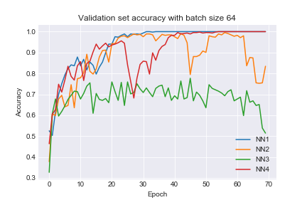

# **Machine Learning course**

This repository contains three assignments for the ML course and the final project. The said project is a study of Convolutional Neural Networks applied to the task of classify MRI brain scan (as .png files) into three cancer categories.

More detailed info can be found on "ProyectoML.pdf" file.
